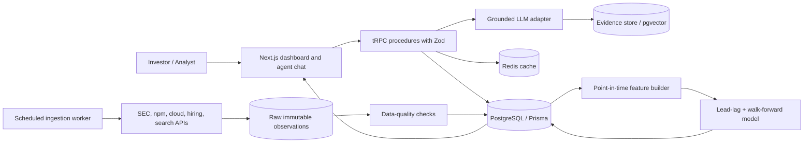
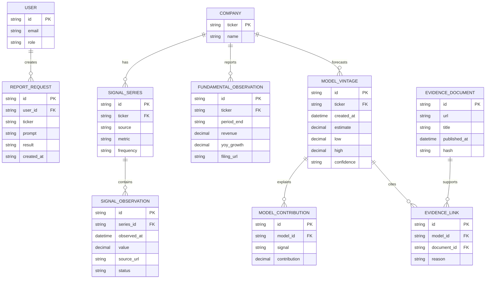

# Technical design and delivery plan

**Production roadmap** — not what this take-home ships.

The checked-in prototype is a Python research pipeline (SEC / XBRL / npm / Wikimedia collectors, ridge walk-forward) plus an annotated React/Vite dashboard. Streamlit is an optional fallback. The stack below is the target if this workflow were productized.

## Product boundary

The MVP is a ticker-level research workflow for Datadog. It ingests public time-series signals, calculates point-in-time features, runs a transparent model, and exposes an evidence-linked summary. It does not execute trades, provide personalized investment advice, or ingest private customer telemetry.

## Recommended stack

| Layer | MVP choice | Reason |
|---|---|---|
| Web | Next.js App Router, React, TypeScript, Tailwind, Recharts | Matches the job description and supports fast dashboard iteration. |
| API | tRPC on a TypeScript Node runtime with Zod validation | End-to-end type safety between React and server procedures. |
| Persistence | PostgreSQL with Prisma | Durable source observations, model vintages, evidence, users, and audit events. |
| Jobs | A scheduled worker using a queue abstraction | Separates ingestion from request latency and supports retries. |
| Cache | Redis-compatible cache | Avoids repeated public-API calls and duplicate LLM requests. |
| Documents | Object storage plus PostgreSQL metadata; optional pgvector | Keeps evidence inspectable. Add a dedicated vector store only when corpus scale requires it. |
| AI | Provider-neutral LLM adapter with structured JSON output | Enables grounded summaries, provider fallback, and test doubles. |
| Hosting | Vercel for web/API and managed Postgres for MVP | Low operational overhead for a two-week prototype. |
| Observability | Structured logs, Sentry, and product metrics | Tracks freshness, failures, latency, and user corrections. |

## Architecture



## Data model



## tRPC contract

```ts
const tickerInput = z.object({ ticker: z.string().regex(/^[A-Z.]{1,8}$/) });

export const appRouter = router({
  companyOverview: publicProcedure.input(tickerInput).query(/* profile, latest KPIs, freshness */),
  signalSeries: publicProcedure.input(z.object({
    ticker: tickerInput.shape.ticker,
    signal: z.enum(['browser_rum_downloads', 'dd_trace_downloads', 'cloud_growth', 'hiring', 'search_attention']),
    start: z.coerce.date(), end: z.coerce.date()
  })).query(/* point-in-time observations */),
  earningsTracker: publicProcedure.input(tickerInput).query(/* estimate, baseline, confidence, contributions, QC */),
  evidence: publicProcedure.input(z.object({ ticker: tickerInput.shape.ticker, query: z.string().max(300) })).query(/* cited source cards */),
  askResearchAgent: protectedProcedure.input(z.object({ ticker: tickerInput.shape.ticker, question: z.string().min(3).max(2000) })).mutation(/* retrieval + grounded structured answer */),
  saveReport: protectedProcedure.input(z.object({ ticker: tickerInput.shape.ticker, title: z.string(), body: z.string() })).mutation(/* audit and persistence */)
});
```

Every model output contains `model_version`, `as_of`, `feature_cutoff`, `source_ids`, `confidence`, and `limitations`. This makes a result reproducible after the underlying source updates.

## Ingestion and QC rules

Each connector writes an immutable raw record before transformation. A record is rejected when its timestamp is invalid, source URL is absent, value is non-numeric, or a duplicate hash already exists. A warning is emitted for a missing expected period, a day-over-day move above a configurable threshold, a source schema change, or a freshness SLA breach. Quarterly aggregation uses the observation date, not the fetch date, and point-in-time joins prevent future observations from entering earlier vintages.

## AI grounding policy

The agent retrieves only approved evidence documents and model cards. It must cite every factual statement that is not a direct calculation. It must distinguish reported facts, model estimates, analyst hypotheses, and unresolved questions. A response validator rejects uncited numeric claims, unsupported certainty, and buy/sell language. The fallback answer reports the data status instead of improvising when evidence is missing.

## Test plan

Unit tests cover date aggregation, YoY calculations, lag construction, missing-data handling, winsorization, model serialization, and confidence grading. Integration tests cover connector retries, database idempotency, tRPC input validation, evidence retrieval, and LLM structured-output parsing. End-to-end tests cover loading `/dashboard/DDOG`, changing date range, viewing source provenance, and asking a grounded question. Contract tests pin the SEC and npm response fixtures. Security tests cover authorization, prompt injection in evidence text, rate limits, secrets exposure, and unsafe HTML rendering.

## Two-week build plan

| Day | Deliverable | QA gate |
|---|---|---|
| 1 | Product brief, repo, CI, schema, wireframe | TypeScript strict mode and lint pass. |
| 2 | SEC and npm connectors | Fixture tests and idempotent loads. |
| 3 | Feature builder and lead–lag table | Hand-calculated fixture assertions. |
| 4 | Walk-forward model and baseline | No future rows in training windows. |
| 5 | Dashboard header and signal charts | Loading, empty, and error states. |
| 6 | Estimate card and evidence panel | Every number has a source or formula. |
| 7 | tRPC procedures and persistence | Contract and authorization tests. |
| 8 | Grounded agent answer | Citation and unsupported-claim rejection. |
| 9 | Export report and model vintage | Reproducibility from stored vintage. |
| 10 | Alert prototype and freshness badges | Retry and notification tests. |
| 11 | E2E, security, and accessibility pass | Keyboard navigation and no critical findings. |
| 12 | Performance and caching | Dashboard p95 target under 2 seconds on cached data. |
| 13 | Staging deployment and documentation | Fresh-clone setup succeeds. |
| 14 | Presentation rehearsal and final QC | Demo script works from clean environment. |

## Definition of done

A clean checkout can ingest public fixtures, run the analysis, render the DDOG dashboard, display the current estimate and its limitations, answer one grounded question with citations, export the panel, pass automated tests, and explain exactly which conclusions are supported by the data.
